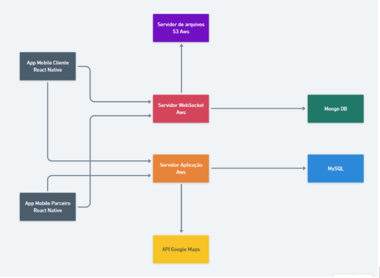

# PopAuto: Aplicativo móvel de busca e suporte automotivo geolocalizados.

Rafael Estevam de Oliveira
Fatec Prof. Jessen Vidal
[rafael.oliveira253@fatec.org.br](mailto:rafael.oliveira253@fatec.org.br)

**Resumo** - Este artigo traz, em detalhes, a proposta de um aplicativo que auxilia os motoristas na busca por suporte automotivo de acordo com a sua localização atual. Cerca de 70% da frota veicular não possui quaisquer seguros e, portanto, encontram dificuldades na hora de pedir socorro. O aplicativo será um facilitador no momento em que o motorista precisar localizar algum serviço automotivo, para ele poder seguir sua viagem. Para oferecer tal solução, o aplicativo contará com o registro de profissionais e empresas parceiras para a prestação do serviço necessário. Os profissionais poderão interagir com o motorista, oferecer e negociar os serviços através do aplicativo.

**Palavras-chave:** Seguro. Aplicativo. Veículos. Localização.

**Abstract** - This article get, with details, a suggestion of app that help the drivers to search for help to your vehicle, by geo location. Currently, 70% of the vehicular fleet not have anything vehicle insurance, therefore, the drivers have hardest to get a help. This app will easy in the moment that the driver to need search any automotive service, so he can continue his travel. To offer this solucion, the app will have with professionals and business partner to offer the necessary automotive service. The partners will can interact with the driver, to offer and negotiate the service through of app.

**Keywords:** Insurance. App. Vehicle. Geolocation.

## Introdução

Diariamente, inúmeros veículos apresentam problemas nas rodovias do país. Quando isso acontece, não somente o motorista sofre com o problema do veículo parado, como todos os outros motoristas, que estão trafegando próximos a ele. O veículo parado causa problemas na malha viária como lentidão, engarrafamentos e até outros acidentes, em decorrência do trânsito lento. Portanto, quanto mais o motorista e o veículo ficarem parados no trânsito, mais transtornos e riscos, todos ao redor estarão sujeitos a muita perda de tempo e a riscos de acidente.

A solução encontrada é disponibilizar um aplicativo que oferece serviços essenciais para o motorista, como mecânicos, reboques e borracheiros, de acordo com a sua localização. O aplicativo visa oferecer, com mais agilidade, suporte automotivo para o motorista e ao veículo, para tirá-lo o mais rápido possível da situação em que se encontra.

O presente trabalho é composto pelas seguintes seções. A Seção 2 aborda a motivação da aplicação. A Seção 3 apresenta a proposta de solução. A Seção 4 aborda as tecnologias empregadas.

## 2 - Proposta de Solução

O PopAuto é um aplicativo mobile que tem como principal objetivo, oferecer com rapidez, suporte automotivo aos motoristas que estão numa determinada localização, onde não conhecem os profissionais de uma determinada região.

Além disso, com seu catálogo de serviços e profissionais, o aplicativo supre as necessidades básicas de um motorista que não possui seguro, oferecendo, através de parceiros cadastrados na plataforma, uma gama de serviços de suporte e socorro automotivo, como guincho, borracheiros e mecânicos.

Através do aplicativo, o motorista poderá detalhar o problema ocorrido e solicitar suporte pelo aplicativo. Os prestadores poderão ver a descrição do problema e oferecer seu suporte na localização da ocorrência, indo até o motorista e prestando o serviço necessário.

Os prestadores de serviço poderão ser independentes (autônomos) ou empresas do ramo, como oficinas mecânicas entre outros e os valores serão negociados entre o motorista e o prestador.

A plataforma fará a ponte entre o motorista e o profissional, e desta forma, poderá oferecer os serviços automotivos para os motoristas.

## 3 - Motivação

No Brasil, a frota de veículos rodando nas ruas é cada vez maior. Grande parte desta frota roda nas ruas sem qualquer seguro contratado, exceto o seguro obrigatório DPVAT. Hoje, cerca de 70% da frota trafega sem qualquer seguro particular, segundo dados da Confederação Nacional das Empresas de Seguros Gerais (CNSEG).

Devido à falta do seguro, muitos motoristas ficam sem o amparo mecânico necessário em caso de quebra do veículo em estrada, deixando o motorista numa situação de perigo e atrapalhando o tráfego ao redor. Além disso, o motorista não conta com o suporte em qualquer lugar que ele esteja, levando o motorista a buscar ajuda numa localização que não conhece, tendo que contar com a ajuda de terceiros em muitas situações. Outro aspecto que deve ser levado em consideração é o tempo que o motorista perde nessa busca por ajuda, que o expõe a situações de perigo.

Todo motorista, quando sai com seu veículo, está sujeito à quebra do veículo e necessidade de suporte automotivo, entretanto, o motorista que não possui seguro sofre muito mais transtornos, pois não possui um recurso ao qual recorrer e perder muito mais tempo buscando ajuda na localização que se encontra, ainda mais se o motorista não a conhecer.

## 4 - Tecnologias empregadas

Com base na proposta do aplicativo e nos recursos que serão adicionados a ele, foi pensado uma estrutura com base em determinadas tecnologias, a fim de garantir a viabilidade e disponibilidade do serviço.

## 4.1 - Linguagens de programação

- Javascript
- Sql

## 4.2 - Bibliotecas

- React
- React Native
- Socket IO
- Google Maps API

## 4.3 - Infraestrutura

- Servidores AWS
- Node JS

## 4.4 - Banco de dados

- Mongo DB (NoSQL)
- MySql (SQL)

## 4.5 - Recursos

- Busca geolocalizada de profissionais
- Conversa entre motorista e profissional
- Envio de fotos

## 4.6 - Exemplo de estrutura da aplicação

A fim de esclarecer como as tecnologias serão interligadas entre si, abaixo há o fluxograma de como elas se comunicarão.

## 4.7 Recursos e finalidade

### 4.7.1 Aplicativo mobile do Cliente

O aplicativo mobile do cliente será desenvolvido com React Native e contará com localização de profissionais por geolocalização, troca de mensagens entre o cliente e o prestador de serviço (chat) e o envio de foto para análise e orçamento do serviço.

### 4.7.2 Aplicativo mobile do Parceiro

O aplicativo mobile do parceiro será desenvolvido em React Native e contará com os recursos de troca de mensagens, recebimento de fotos e envio de orçamento para o cliente.

### 4.7.3 Servidor Web Socket

Este servidor será o responsável por receber as interações via protocolo web socket e irá orquestrar os eventos de envio de mensagem, usando a biblioteca Socket IO. As mensagens serão salvas dentro do mongo DB e as imagens serão salvas dentro do servidor S3 da Aws.

### 4.7.4 Servidor S3 Aws

Este servidor receberá as imagens trocadas entre cliente e atendente através das mensagens trocadas via servidor web socket. Este serviço é oferecido pela AWS.

### 4.7.5 Mongo DB

Irá armazenar as mensagens trocadas entre cliente e atendente. O Mongo DB será usado para garantir a escalabilidade da aplicação, principalmente no contexto de chat, onde poderão haver milhares de mensagens sendo trocadas ao mesmo tempo.

### 4.7.7 Servidor da Aplicação

Será o responsável por garantir a funcionalidade de outras partes do aplicativo, como cadastros de informação, regras de negócio e integração com o Google Maps.

### 4.7.8 Google Maps API

Biblioteca do Google que irá fornecer informações de locais próximos ao usuário de acordo com sua geolocalização (latitude, longitude). Através dessa plataforma, será possível identificar, quais profissionais e empresas do ramo automotivo estarão próximos ao usuário, no momento da consulta.

### 4.7.9 MySQL

Banco de dados relacional que irá armazenar dados gerais da aplicação, como cadastros de usuários e profissionais.

## Repositórios

**Aplicação Web**

https://github.com/RafaelEstevam/popauto-front

**Aplicação Mobile**

https://github.com/RafaelEstevam/popauto-mobile

**Backend**

https://github.com/RafaelEstevam/popauto-back

## Referências

COSTA, Karen. 70% da frota brasileira circula sem seguro. 2018. Disponível em: https://encontresuafranquia.com.br/70-da-frota-brasileira-de-carros-circula-sem-seguro-de-carro/. Acesso em: 10 abr. 2021.

OLIVEIRA, Ricardo de. Quantos carros possuem seguro no brasil?. 2018 . Disponível em: https://www.noticiasautomotivas.com.br/quantos-carros-possuem-seguro-no-brasil/. Acesso em: 20 abr. 2021.

AUTOSEG. Sistema de estatísticas de automóveis da SUSEP . Disponível em: http://www2.susep.gov.br/menuestatistica/Autoseg/principal.aspx/. Acesso em: 22 abr. 2021.

CQCS. Apesar de número baixo de carros segurados no Brasil entidades estão otimistas. 2020 . Disponível em: https://www.cqcs.com.br/noticia/apesar-de-numero-baixo-de-carros-segurados-no-brasil-entidades-estao-otimistas/. Acesso em: 24 abr. 2021.

GOOGLE. Places API. 2021. Disponível em: https://developers.google.com/maps/documentation/places/web-service/overview?hl=pt-br. Acesso em 26 mai. 2021.

AWS. Amazon S3. 2021. Disponível em: https://aws.amazon.com/pt/s3/. Acesso em 26 mai. 2021.

SOCKET IO. Documentation. 2021. Disponível em: https://socket.io/docs/v4. Acesso em 26 mai. 2021.

REACT NATIVE. Introduction. 2021. Disponível em: https://reactnative.dev/docs/getting-started. Acesso em 26 mai. 2021.

MONGO DB. Guides. 2021. Disponível em: https://docs.mongodb.com/guides/ . Acesso em 26 mai. 2021.
